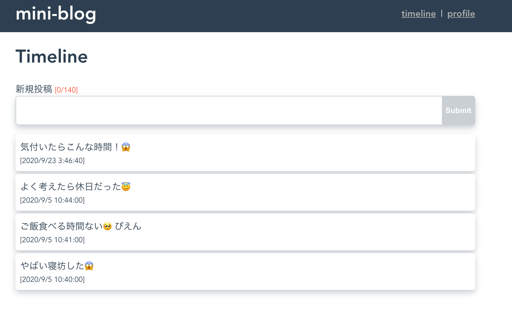

# mini-blog
Vue.jsを使ってミニブログをつくる入門コンテンツです。
初めてVueを触るという方に向けのコンテンツで、Vueの基本的なエッセンスを理解することが目的です。
Vuexやコンポーネント分離などのAdvancedな内容については現時点で含まれていません。

## 完成イメージ

## モジュール

1. [環境のセットアップ](docs/1_setup.md)
2. [Vue-routerによる複数画面アプリの作成](docs/2_vue-router.md)
3. [Vueのコンポーネントの基本](docs/3_vue-component-basic.md)
4. [HTTPによるAPI通信](docs/4_http-api-basic.md)

