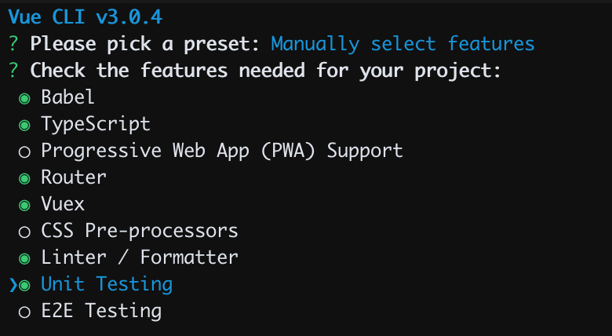
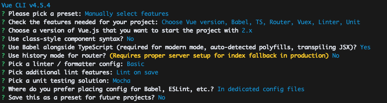
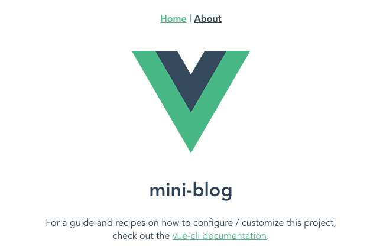

# 1. 環境のセットアップ

## 1.1. node.jsのインストール

* Windows / Mac共通
  * インストーラーからインストール
https://nodejs.org/ja/download/
* Mac
  * homebrewでインストール
  * nodebrewでインストール

## 1.2. Vue CLIをインストール

公式を参照
* https://cli.vuejs.org/guide/installation.html
```bash
$ npm install -g @vue/cli
```
動作確認を実施
```bash
$ vue --version
@vue/cli 4.5.4
```

## 1.3. ボイラーテンプレートの作成


### 1.3.1 vue createによるプロジェクトの初期設定
`vue create`サブコマンドでボイラーテンプレートを生成できる

```bash
$ vue create mini-blog
Vue CLI v4.5.4
? Please pick a preset:
  Default ([Vue 2] babel, eslint)
  Default (Vue 3 Preview) ([Vue 3] babel, eslint)
❯ Manually select features
```
Manually select featuresを選択し、以下のように選択する



その他の設定については以下の通り選択



* バージョンは2.xを選択
* class-styleコンポーネントを使うかと聞かれるのでNoを選択
* Babel alongside TypeScriptを使うかと聞かれるのでYesを選択
* History Modeを利用するかと聞かれるので、Noを選択（ハッシュモードを選択）
* LinterのスタイルはESLint with error prevention onlyを選択
* Lintは保存時に実行されるように設定
* unittestのフレームワークはMocha + Chaiを選択
* BabelやESLintなどの設定はpackage.jsonとは別に保存するように設定

### 1.3.2 ローカル開発サーバーの動作確認

プロジェクトルートで`npm run serve`コマンドを入力することで開発用サーバーを立ち上げることができる。
```bash
$ cd mini-blog
$ npm run serve
```

コンパイル成功後に[http://localhost:8080/](http://localhost:8080/)にアクセスすることで開発用サーバーにアクセスできる。開発用サーバーではHot-Module-Replacement (HMR)という機能が有効になっており、ソースコードの変更が即座にブラウザ上のDOMに反映されるようになっている。試しにこの状態で`src/views/Home.vue`をテキストエディタで開き、4行目を以下のように変更する。

変更前
```html
    ...
    <HelloWorld msg="Welcome to Your Vue.js + TypeScript App" />
    ...
```
変更後
```html
    ...
    <HelloWorld msg="mini-blog" />
    ...
```

保存後、ブラウザで先ほどのローカルサーバーを確認し、ソースコードの更新に合わせてされていることを確認する。



#### 1.3.4 Lintの動作確認

初期設定時にLint on Saveを有効にしたため、ソースコードの保存時に自動的にLintが実行されるようになっている。試しに上記の`src/views/Home.vue`に意図的に以下のように改行を入れる。

変更前
```html
    ...
    <HelloWorld msg="mini-blog" />
    ...
```

変更後
```html
    ...
    <HelloWorld
    msg="mini-blog"
    />
    ...
```

この状態で保存するとLintが実行され、挿入した改行が削除されることが確認できる。


#### 1.3.3 ユニットテストの動作確認

プロジェクトルートで`npm run test:unit`コマンドを入力することでコンポーネントのユニットテストを実行することができる。
```bash
$ npm run test
...
 DONE  Compiled successfully in 2390ms

  [=========================] 100% (completed)

 WEBPACK  Compiled successfully in 2390ms

 MOCHA  Testing...


  HelloWorld.vue
    ✓ renders props.msg when passed


  1 passing (41ms)

 MOCHA  Tests completed successfully
```

babel + Webpackによるトランスパイル＆ビルドが実行されたのち、MOCHAによるテストが実行される。ここではテストケースを1件追加してテストが正常に動作することを確認する。

`tests/unit/example.spec.ts`を開き、以下のように失敗するテストケースを一件追加する。

変更前
```javascript
...
describe('HelloWorld.vue', () => {
  it('renders props.msg when passed', () => {
...
    expect(wrapper.text()).to.include(msg)
  })
})
```

変更後
```javascript
...
describe('HelloWorld.vue', () => {
  it('renders props.msg when passed', () => {
...
    expect(wrapper.text()).to.include(msg)
  })
  /* 以下を追記 */
  it('can render another message', () => {
    const msg = 'another message';
    const wrapper = shallowMount(HelloWorld, {
      propsData: { msg }
    });
    expect(wrapper.text()).to.include('xxx');
  });
  /* ここまで追記 */
})
```

保存後、再度`npm run test:unit`を実行し、今追加したテストケースが失敗することを確認する。作成したテストケースを以下のようにパスするように変更する。

変更前
```javascript
...
    expect(wrapper.text()).to.include(msg);
...
```

変更後
```javascript
...
    expect(wrapper.text()).to.include(msg);
...
```

ここで再三`npm run test:unit`を実行し、2件のテストがいずれもパスすることを確認する。


開発用環境について準備ができたので[Module 2](2_vue-router.md)に続く

