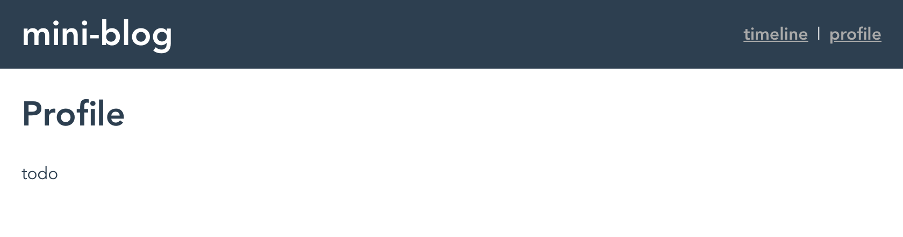

# 2. Vue-routerによる複数画面アプリの作成

Vue-routerを用いることで、URLパスの値によって異なる画面（コンポーネント）を表示することができる。画面とコンポーネントの対応は`src/router/index.ts`で定義されており、この設定を変更してURLパスごとにどのコンポーネントにRoutingするかを決めることができる。

```javascript
...
  const routes: Array<RouteConfig> = [
  {
    path: '/',
    name: 'Home',
    component: Home
  },
  {
    path: '/about',
    name: 'About',
    // route level code-splitting
    // this generates a separate chunk (about.[hash].js) for this route
    // which is lazy-loaded when the route is visited.
    component: () => import(/* webpackChunkName: "about" */ '../views/About.vue')
  }
]
...
```

Routerによって選択されたコンポーネントは`src/App.vue`内の以下の箇所にマウントされる。

```javascript
...
    <router-view />
...
```
なお、`*.vue`ファイルは一つのコンポーネントを定義するためのカスタムファイルフォーマットであり、HTMLテンプレート、Vueコンポーネントの動作を表すスクリプト、コンポーネントに適用するCSSなどがふくまれている。[参考](https://vue-loader-v14.vuejs.org/ja/start/spec.html)


## 2.1. 画面コンポーネントの作成

mini-blogアプリではtimeline画面とprofile画面を切り替える仕様とする。`src/views/Timeline.vue`という名前で以下の内容のファイルを作成する。

```javascript
<template>
  <div class="timeline">
    <h1>Timeline</h1>
    <p>todo</p>
  </div>
</template>

<script lang="ts">
import Vue from "vue";

export default Vue.extend({
  name: "Timeline"
});
</script>
<style scoped>
</style>
```

同様に`src/views/Profile.vue`についても以下の通り作成する

```javascript
<template>
  <div class="timeline">
    <h1>Profile</h1>
    <p>todo</p>
  </div>
</template>

<script lang="ts">
import Vue from "vue";

export default Vue.extend({
  name: "Profile"
});
</script>
<style scoped>
</style>
```

### 2.2. Routingの設定

`#/`にアクセスした時に上記の`Timeline`コンポーネント、`#/profile`にアクセスした際に`Profile`を表示するよう設定する。`src/router/index.ts`にてroutesを以下のように書き換える

```typescript
...
const routes: Array<RouteConfig> = [
  {
    path: '/',
    name: 'Timeline',
    component: Timeline
  },
  {
    path: '/profile',
    name: 'Profile',
    component: Profile
  }
]
...
```
また、モジュールの冒頭部に以下のように`Timeline`と`Profile`をimportする文も付け加える
```typescript
...
import Timeline from '../views/Timeline.vue'
import Profile from '../views/Profile.vue'
...
```

### 2.3. ナビゲーションの設定

URLパスに対してリンクを作成する際は`<router-link>`要素をtemplate内に挿入する。プロパティは[APIリファレンス](https://router.vuejs.org/ja/api/#router-link)を参照。
```html
<div id="nav">
  <router-link to="/">timeline</router-link>
  <router-link to="/profile">profile</router-link>
</div>
```

`src/App.vue`の中身を[こちら](2.3.App.vue)を参考に書き換え、右上メニューによるナビゲーションが正常に動作することを確認する。
なお、vue-routerは内部的にBrowser History APIを利用しており、ブラウザの戻る/進むボタンを利用して直前にアクセスしたURLパスに遷移することができる。



### 2.4. プログラム的な画面遷移

一定時間後に別の画面に切り替えるなど、プログラム的にコンポーネント間の遷移を行いたい場合は、`router.push("/path/to/component")`というコードを記述することで実現可能。こちらもBrowser History APIを内部的に利用しており、ブラウザの戻る/進むボタンでページを移動することができる。この挙動をさせたくない場合は`router.replace("/path/to/component")`というメソッドを利用する。


vue-routerの挙動について確認できたので[Module 3](3_vue-component-basic.md)に続く