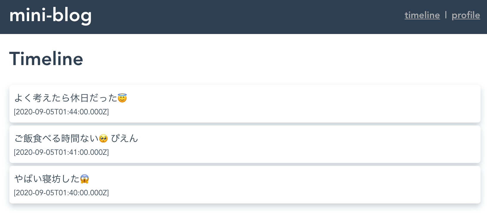
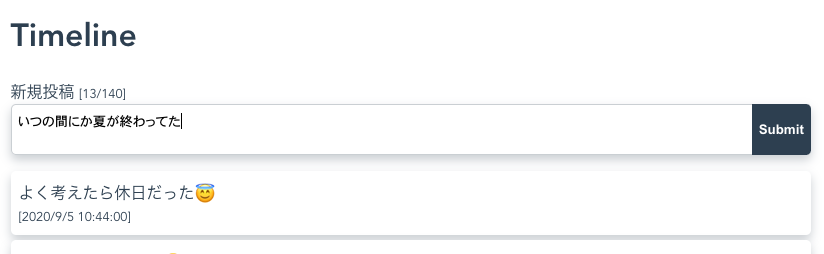
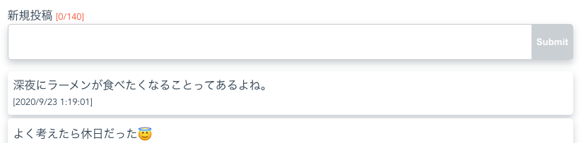

# 3. Vueのコンポーネントの基本

全てのVueのコンポーネントはVueインスタンスと呼ばれるオブジェクトであり、コンポーネント同士はそれぞれ独立して管理されている。
Vueインスタンスにはライフサイクルが定義されており、コンポーネントの初期化から、テンプレートのコンパイル、マウント、アンマウント、破棄という風に状態遷移する。[参考](https://jp.vuejs.org/v2/guide/instance.html#%E3%82%A4%E3%83%B3%E3%82%B9%E3%82%BF%E3%83%B3%E3%82%B9%E3%83%A9%E3%82%A4%E3%83%95%E3%82%B5%E3%82%A4%E3%82%AF%E3%83%AB%E3%83%95%E3%83%83%E3%82%AF)
Vueコンポーネントは階層構造をとることができ、あるコンポーネントの中で別のコンポーネントを利用している場合、利用している側を親コンポーネント、利用されている側を子コンポーネントと呼ぶ。子コンポーネントは親コンポーネントにマウントされる前に初期化され、アンマウントされると破棄される。


Vueインスタンスは初期化時に渡された`data`オブジェクトの値をリアクティブに監視し、
`data`オブジェクトのプロパティが変更された際にビューに自動的に反映する。[参考](https://jp.vuejs.org/v2/guide/instance.html#%E3%83%87%E3%83%BC%E3%82%BF%E3%81%A8%E3%83%A1%E3%82%BD%E3%83%83%E3%83%89)
これは内部的にはES5の`Object.defineProperty`をつかって`data`オブジェクトの全てのプロパティにsetter/getterを設定することにより実現している。[参考](https://jp.vuejs.org/v2/guide/reactivity.html#%E5%A4%89%E6%9B%B4%E3%81%AE%E8%BF%BD%E8%B7%A1%E6%96%B9%E6%B3%95)

## 3.1. dataオブジェクトプロパティの単方向バインディング

`data`オブジェクトの値を参照するには、Mustache（`{{}}`）構文を用いる。
`src/views/Timeline.vue`を以下のように変更する

```javascript
<template>
  <div class="timeline">
    <h1>Timeline</h1>
    {{message}}
  </div>
</template>

<script lang="ts">
import Vue from "vue";

export default Vue.extend({
  name: "Timeline",
  data() {
    return {
      message: "loading"
    };
  }
});
</script>
```

ブラウザで動作を確認し、「loading」が表示されていることを確認する。単方向バインディングではmessageの値が変わると、レンダリングされるDOMもリアクティブに変化する。

## 3.2. コンポーネントのライフサイクルフック

ライフサイクルフックを用いることで、コンポーネントのマウント前や破棄前の挙動を追加することができる。詳細は[インスタンスライフサイクルフック](https://jp.vuejs.org/v2/guide/instance.html#%E3%82%A4%E3%83%B3%E3%82%B9%E3%82%BF%E3%83%B3%E3%82%B9%E3%83%A9%E3%82%A4%E3%83%95%E3%82%B5%E3%82%A4%E3%82%AF%E3%83%AB%E3%83%95%E3%83%83%E3%82%AF)を参照。ここでは`src/views/Timeline.vue`に`mounted`フックを追加して、メッセージを変更する。

```javascript
...
export default Vue.extend({
  name: "Timeline",
  data() {
    return {
      message: "loading"
    };
  },
  mounted() {
    // 本来はここでメッセージの読み込み処理を実施
    setTimeout(() => {
      this.message = "no message found!";
    }, 3000);
  }
});
...
```

ブラウザで動作を確認し、loadingの表記が3秒後に"no message found!"という文字列に変わることを確認する。なお、Profile画面に一度遷移した後再度Timeline画面に遷移すると、新しいTimelineコンポーネントが作成され、マウントされるので、再度loadingの表記が表示されて3秒後にメッセージが変わることが確認できる。

## 3.3. v-ifディレクティブによる条件分岐

v-ifディレクティブを使用することで、条件に応じてDOMをレンダリングするかどうかを制御できる。`v-if="..."`で指定した式が真値であれば当該の要素をレンダリングし、そうでなければレンダリングを行わない。先ほどの`src/views/Timeline.vue`を以下のようにv-ifを使った書き方に変更する。

```javascript
...
  <div class="timeline">
    <h1>Timeline</h1>
    <div v-if="isReady">{{message}}</div>
    <div v-else>loading...</div>
  </div>
...
  data() {
    return {
      message: "",
      isReady: false
    };
  },
  mounted() {
    // メッセージの読み込み処理
    setTimeout(() => {
      this.message = "no message found!";
      this.isReady = true;
    }, 3000);
  }
...
```

ブラウザで動作を確認し、先ほどと同じように動作することを確認する。

## 3.4. v-forディレクティブによる繰り返し

v-forディレクティブを使用することで、配列で管理されたオブジェクトとDOMの要素を紐づけることができる。ここでは以下のようにミニブログのメッセージを`tweets`という配列で管理することとする。本来であればmountされたタイミングでバックエンドからデータの読み込みを行い、`tweets`に格納するという処理を入れるが、ここではsetTimeoutで読み込み処理を模倣している。

```javascript
...
  data() {
    return {
      tweets: [],
      isReady: false
    };
  },
  mounted() {
    // メッセージの読み込み処理
    setTimeout(() => {
      this.isReady = true;
      this.tweets = [
        {
          id: 3,
          message: "よく考えたら休日だった😇",
          date: "2020-09-05T01:44:00.000Z"
        },
        {
          id: 2,
          message: "ご飯食べる時間ない🥺ぴえん",
          date: "2020-09-05T01:41:00.000Z"
        },
        {
          id: 1,
          message: "やばい寝坊した😱",
          date: "2020-09-05T01:40:00.000Z"
        }
      ];
    }, 3000);
  }
...
```

これを表示するため、以下のように`v-for`ディレクティブを利用する。`v-for`を利用する場合、要素を特定するためのkey属性を指定する必要がある。[参考](https://jp.vuejs.org/v2/guide/list.html#%E3%82%B3%E3%83%B3%E3%83%9D%E3%83%BC%E3%83%8D%E3%83%B3%E3%83%88%E3%81%A8-v-for)

```javascript
...
    <div v-if="isReady">
      <ul>
        <li v-for="tweet in tweets" v-bind:key="tweet.id">
          <p>{{tweet.message}}</p>
          <span class="small">[{{tweet.date}}]</span>
        </li>
      </ul>
      <span v-if="tweets.length == 0">no message found!</span>
    </div>
    <div v-else>loading...</div>
```

最後にvueファイルの末尾にCSSを挿入する。

```css
...
<style scoped>
ul {
  width: 100%;
  padding: 0;
}
li {
  list-style-type: none;
  padding: 0.5em;
  margin: 5px 0;
  background-color: #fff;
  box-shadow: 0px 5px 10px rgba(44, 62, 80, 0.25);
  border-radius: 5px;
}
p {
  margin: 0;
}
.small {
  font-size: 0.8em;
}
</style>
```

以下のようにタイムラインが表示されることを確認する。


## 3.5. filterによる変換処理

上記の例ではタイムラインの投稿時間がISO 8601(UTC)で保持されており、このままでは表示が直感的でないため、クライアントのタイムゾーンに合わせた表記に変換する。

vueで`data`オブジェクトのデータに特定の処理を行って表示するためにはfilterが利用できる。filterを利用するには、まず以下のようにコンポーネント内でfilterを定義する。

```javascript
...
export default Vue.extend({
  name: "Timeline",
  filters: {
    dateFilter(date: string) {
      return new Date(date).toLocaleString();
    }
  },
  data() {
...
```

filterを定義したあとは以下のように`|`(パイプ)を使うことでテンプレート内で呼び出すことができる。

```javascript
...
          <span class="small">[{{tweet.date | dateFilter}}]</span>
...
```

ブラウザを確認し、日付がJST表記になったことを確認する。

## 3.6. v-modelディレクティブによる双方向バインディング

メッセージの表示が実装できたので、ここからはメッセージの投稿機能を実装する。この時、以下のように入力したメッセージを格納する`text`というデータプロパティを新たに作成する。

```javascript
...
  data() {
    return {
      text: "",
      tweets: [],
      isReady: false
    };
  },
...
```

`v-model`ディレクティブを用いることで、データプロパティをフォーム要素に関連づけることができる。ここでは以下のようにh1要素とタイムラインの間にフォームを作成する。これにより、textareaに文字が入力されると、`text`プロパティが更新されるだけでなく、`text`プロパティが更新されるとtextareaの内容も変更される。これを双方向バインディングと呼ぶ。

```html
...
    <h1>Timeline</h1>
    <p>
      新規投稿
      <span class="small">[{{text.length}}/140]</span>
    </p>
    <div class="wrapper">
      <textarea v-model="text"></textarea>
      <button>Submit</button>
    </div>
    <div v-if="isReady">
...
```

vueファイル末尾のCSSにも以下を追加する。

```css
.wrapper {
  display: flex;
  box-shadow: 0px 5px 10px rgba(44, 62, 80, 0.25);
  border-radius: 5px;
}
textarea {
  width: 100%;
  border: solid 1px rgba(44, 62, 80, 0.25);
  border-right: 0;
  border-radius: 5px 0 0 5px;
  outline: none;
  resize: none;
  padding: 0.5em;
}
button {
  flex-shrink: 1;
  border-radius: 0 5px 5px 0;
  background-color: #2c3e50;
  color: #ffffff;
  font-weight: bold;
  border: none;
  outline: none;
  padding: 0.5em;
}
button:disabled {
  background-color: rgba(44, 62, 80, 0.25);
}
.error {
  color: #f84718;
}
```

ブラウザにて動作確認を行い、テキストエリアに入力した文字数に応じて「新規投稿」の横の数値がリアクティブに変化することを確認する。



## 3.7. v-bindディレクティブによる要素の属性へのバインディング

ここで、「メッセージは1文字以上140文字以内でないと投稿できない」というロジックを導入する。この範囲にない場合はSubmitボタンを押せないように以下のようにテンプレートを変更する。

```html
...
      <span
        class="small"
        v-bind:class="{error: text.length == 0 || text.length > 140}"
      >[{{text.length}}/140]</span>
...
      <button v-bind:disabled="text.length == 0 || text.length > 140">Submit</button>
```

ここで、`v-bind`というディレクティブを利用している。`v-bind`を利用することでDOMの属性の付与を制御することができる。この時、hrefのような属性にデータプロパティを入れることも可能であるほか、buttonのdisabledプロパティに真偽値を入れることでdisabled属性をつけるか付けないかを制御したり、特定のclassを付与するか、しないかという制御をおこなったりできる。[参考](https://jp.vuejs.org/v2/api/#v-bind)

## 3.8. 算出プロパティの利用

前述のv-bindディレクティブの中で、真偽値を持つ式を利用しているが、この書き方では記述が冗長なだけでなく、ビジネスロジックがテンプレートの中に入ってしまい、保守性が下がってしまう。そこでvueの`computed`プロパティ（算出プロパティ）を使う。以下のように、`computed`プロパティを定義する。

```javascript
...
  data() {
    return {
      text: "",
      tweets: [],
      isReady: false
    };
  },
  computed: {
    hasError() {
      return this.text.length == 0 || this.text.length > 140;
    }
  },
  mounted() {
...
```

hasErrorは依存するプロパティ（ここでは`this.text`）の値が変化すると都度計算され、値がキャッシュされる。テンプレートからは以下のようにdataプロパティと同じように参照できる。

```html
...
      <span class="small" v-bind:class="{error: hasError}">[{{text.length}}/140]</span>
...
      <button v-bind:disabled="hasError">Submit</button>
...
```
ブラウザを確認し、動作が先ほどとかわっていないことを確認する。

## 3.9 v-onによるイベントハンドラの登録

最後にsubmitボタンを押した後にメッセージを投稿する機能を作る。まずは以下のようにイベントハンドラをmethodsプロパティの配下に定義する。

```javascript
...
},
  methods: {
    submit() {
      if (this.hasError) return;
      const tweet = {
        id: Math.max(this.tweets.map(item => item.id)) + 1,
        message: this.text,
        date: new Date().toISOString()
      };
      this.tweets.unshift(tweet);
      this.text = "";
    }
  },
  mounted() {
...
```

あとはsubmitボタンに`v-on`ディレクティブを使って以下のようにこのイベントハンドラをバインドする。

```html
...
      <button v-on:click="submit" v-bind:disabled="hasError">Submit</button>
...
```

なお、`v-on:`および`v-bind:`ディレクティブは省略記法が存在し、それぞれ`@`および`:`と表記することができる。上記のbutton要素であれば以下のような省略が可能。

```html
      <button @click="submit" :disabled="hasError">Submit</button>
```

ブラウザを開き、テキストエリア入力後にsubmitボタンを押すことでメッセージが投稿できることを確認する。



ここまでのソースコードは[3.9.Timeline.vue](3.9.Timeline.vue)を参照

コンポーネントの基本について確認できたので[Module 4](4_http-api-basic.md)に続く

