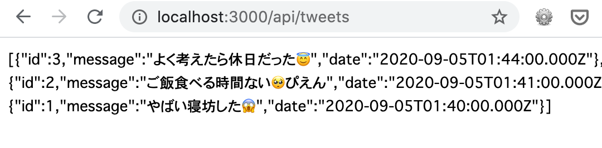

# 4. HTTPによるAPI通信

今の仕様だと、書き込んだデータがコンポーネントを読み込み直すと消えてしまうので、バックエンドに保存する必要がある。今回はモックのAPIサーバーを用いてAPI通信を実装する。
HTTPによる通信方法はいくつかあるが、今回は追加モジュールの不要なfetch APIを用いてバックエンドとデータのやりとりを行う。公式ドキュメントには[axiosを利用した方法](https://jp.vuejs.org/v2/cookbook/using-axios-to-consume-apis.html)も紹介されている。


## 4.1. APIサーバーの起動

このレポジトリの`sample/backend`ディレクトリに移動し、`npm install`を実行した後、`npm start`を実行する。以下のように表示されたらAPIサーバーが正しく起動できている。

```bash
$ npm start
...
listening on port 3000
```

この状態でブラウザで[http://localhost:3000/api/tweets](http://localhost:3000/api/tweets)にアクセスすると、以下のようにJSONが返ってくる。



APIの定義は以下の通り。

| URI | Method | 説明 | パラメータ |
|--|--|--|--|
| /api/tweets | GET | 既存の投稿の一覧を取得 | [request]<br>なし<br>[response]<br>以下のパラメータを含む配列<br>`id` : 投稿一意に識別するためのID<br>`message` : メッセージの内容<br>`date` : 投稿が行われた日時（ISO 8601形式） |
| /api/tweets | POST | メッセージの新規投稿 | [request]<br>`message` : 投稿するメッセージの内容(必須）<br>[response]<br>投稿したメッセージに付与された`id`, `message`, `date` |

なお、今回立ち上げたモックAPIサーバーはCORSを許可している。

## 4.2. APIコールの追加

最初にTypeScriptの型エラーを防ぐために、以下のようなinterfaceを定義する。また、tweetsプロパティを`Array<Tweet>`型として明示的に指定する。

```javascript
...
import Vue from "vue";

interface Tweet {
  id: number;
  message: string;
  date: string;
}

export default Vue.extend({
...
  data() {
    return {
      text: "",
      tweets: [] as Array<Tweet>,
      isReady: false
    };
  },
...
```

mountedフックをSetTimeoutから以下のようにfetchによるAPI呼び出しに変更する。

```javascript
...
  async mounted() {
    // メッセージの読み込み処理
    const res = await fetch("http://localhost:3000/api/tweets");
    this.tweets = await res.json();
    this.isReady = true;
  }
...
```

最後にsubmitメソッドも以下のようにAPI呼び出しに変更する。

```javascript
  methods: {
    async submit() {
      if (this.hasError) return;
      const res = await fetch("http://localhost:3000/api/tweets", {
        method: "POST",
        headers: {
          "Content-Type": "application/json"
        },
        body: JSON.stringify({ message: this.text })
      });
      const tweet = (await res.json()) as Tweet;
      this.tweets.unshift(tweet);
      this.text = "";
    }
```

ブラウザで動作を確認する。投稿後に別のブラウザを立ち上げて、書き込んだメッセージが新しいブラウザ側で読み込めることを確認する。

ここまでのソースコードは[4.2.Timeline.vue](4.2.Timeline.vue)を参照。